# Project Summary
In this project, I will be using a keystroke dataset from Aalto University with over 136 million rows of data contributed by 168,593 participants in an online study. Participants were required to memorize some English sentences and then asked to type them as quickly and accurately as they could. These sentences were randomly selected from a set of 1,525 examples with 3 words and 70 characters maximum. Subjects could type more than 70 characters because there is a chance that participants would forget words or add new characters when typing.

Below are the questions this project will attempt to answer:
<ul>
    <li>What is the typing speed (WPM - word per minute) of each of the 168,593 participants? </li>
    <li>Can participants be grouped by their typing speed as either below average, average, fast or genious typer?</li>
    <li>Are there characters or combination of characters (digraphs - two characters; trigraphs - three characters) that are faster or slower for each user? These characters or combination of characters can help differentiate users.
</ul>

<h4>Data Source</h4>
The data size is about 17GB and can be found <a href="https://userinterfaces.aalto.fi/136Mkeystrokes/" target="_blank">here</a>


# Project Details
The raw dataset folder consist of 168,593 text files (excluding the participants metadata and readme text files) where each text file represent the keystrokes data of the participant. Each text file has about 600 to 800 rows and the dataset has a total of 136 million rows of data. The Figure 1 below shows the dataset folder and Figure 2 shows the keystrokes data for participant 5.

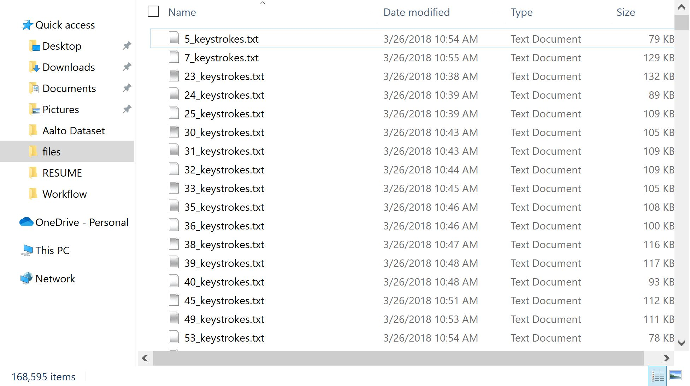
Figure 1: Keystrokes dataset folder.

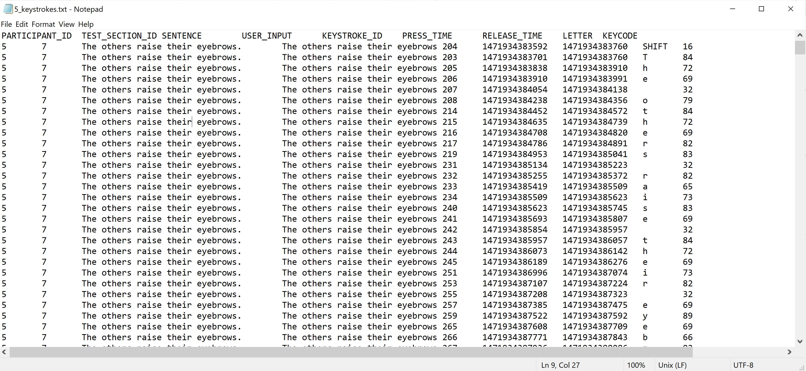
Figure 2: Opening the "5_keystrokes.txt".

The dataset column headers are:

<strong>PARTICIPANT_ID</strong> - The unique ID that identifies each participant.<br>
<strong>TEST_SECTION_ID</strong> - Unique ID of the presented sentence.<br>
<strong>SENTENCE</strong> - Sentence shown to the user.<br>
<strong>USER_INPUT</strong> - Sentence typed by the user after pressing Enter or Next button.<br>
<strong>KEYSTROKE_ID</strong> - Unique ID of the keypress.<br>
<strong>PRESS_TIME</strong> - Timestamp of the key down event (in ms).<br>
<strong>RELEASE_TIME</strong> - Timestamp of the key release event (in ms).<br>
<strong>LETTER</strong> - The typed letter.<br>
<strong>KEYCODE</strong> - The javascript keycode of the pressed key.<br>

# Goal One
<h4>QUESTION: What is the typing speed (WPM - word per minute) of each of the 168,593 participants?</h4>

<h4>ANSWER:</h4>
Recall that each participant had typed 15 sentences. So, I calculated the Word per Minute (WPM) for each of the 15 sentences and then calculated the average WPM. I also recorded the total number of corrected and uncorrected errors/mistakes per sentence per participant.

Below is the formular used in calculating the Net WPM and the Gross WPM.
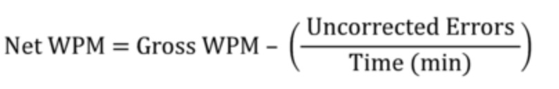
Equation 1: Net WPM formula.

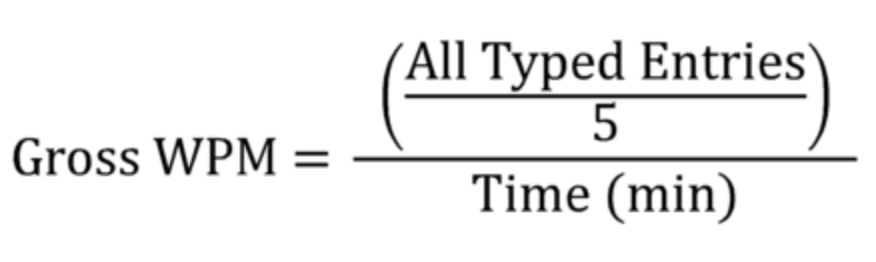
Equation 2: Gross WPM formula.

When typing speed is calculated, a word that contains five characters, such as “I love my computer, don’t you?” would be counted as 6 words, not just 5, for example, (30 characters / 5). Functional keys such as backspace or shift keys are not counted, but all other characters are counted, including spaces, letters, numbers, and punctuation.

The Gross WPM calculation does not put into consideration the uncorrected errors. It is usually a good habit to ensure that typist are not only concerned about speed but also the accuracy of the content being typed. Hence, the Gross WPM is not sufficient, and that is why the Net WPM is more accurate and a useful tool in gauging typing abilities. Typing mistakes play a part in its calculation, so it also measures typing productivity instead of only typing speed. In other words, a fast typist with a lot of mistakes gets a lower WPM score than a slower but more accurate typist.

There are two types of mistakes during typing.
1) Corrected mistakes: The mistakes corrected during typing does not only messes up the typist’s concentration but also causes a brief pause. Besides, function keys such as delete keys take time to press and do not count as characters. This means that the typist has already been penalized for the corrected mistakes. While typists should be encouraged at all costs to avoid mistakes, errors left uncorrected are much more undesirable and devastating than immediately errors resolved while typing.

2) Uncorrected mistakes: To discourage typists from leaving errors uncorrected, the total number of uncorrected errors divided by total typing time is subtracted from the Gross WPM.

Furthermore, I calculated the typing accuracy for each sentence per user. The overall typing accuracy is the average of all the per sentence accuracy. Typing accuracy is considered to be the percentage of correct entries out of the total entries typed. It is calculated as, the total correct characters typed divided by the total numbers of actual characters and then multiplied by 100%. For example, if out of 100 characters, 90 characters are typed correctly, then the typing accuracy is 90%. It is more interesting to note for accuracy, all errors (corrected and uncorrected) are counted/considered, unlike the net WPM calculation.

```python
input_end = int(split_line[6])
duration = (input_end - input_start)/60000  # time to mins
char_count = len(sentence)
input_char_count = len(user_input)
uncorr_errs = enchant.utils.levenshtein(sentence, user_input)
wpm = ((input_char_count/5) - uncorr_errs)/duration
acc = ((char_count - uncorr_errs - corr_errs)/char_count * 100)
```

As shown in the code above, the levenshtein library was used to calculate the number of edits required to make both the actual sentence and the user input sentence the same. This number is the total number of uncorrected mistakes/errors.

The WPM and accuracy for each sentence are stored with table name `wahab_keystrokes` in the `ia626` database. In the table, a row represents a sentence, therefore, the table has a total of 2,528,895 rows of data. The average WPM and accuarcy for each participant is calculated and stored with table name `wahab_summary`. A row in the `wahab_summary` table represents each user typing details, hence, the table has a total of 168,593 rows of data, which is the total number of participants. The code for calculating the avrage WPM and average accuracy is shown below.

```python
#Get user's summary
for i in user_data:
    all_corr_errs.append(i[5])
    all_uncorr_errs.append(i[6])
    all_wpm.append(i[7])
    all_acc.append(i[8])
summary.append((id,sum(all_corr_errs),sum(all_uncorr_errs),
 round(mean(all_wpm)),round(mean(all_acc)),
 overall_s_digraph,overall_s_digraph_time,overall_f_digraph,
 overall_f_digraph_time))
```
For ease of analysis and interpretation, below are the frequency distribution plot of the average WPM and average accuracy.

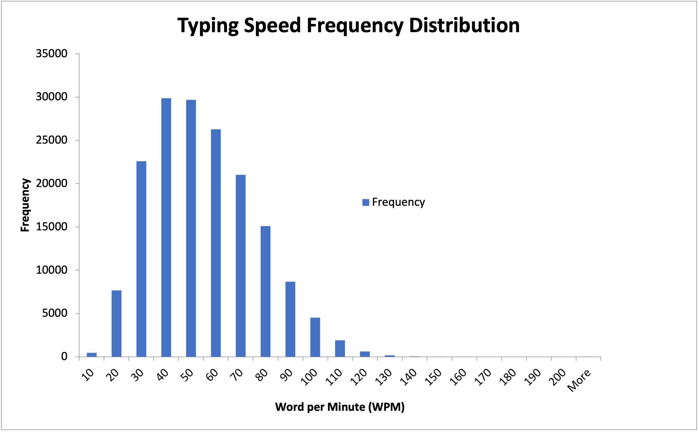
Figure 3: Frequency distribution plot of the average WPM.

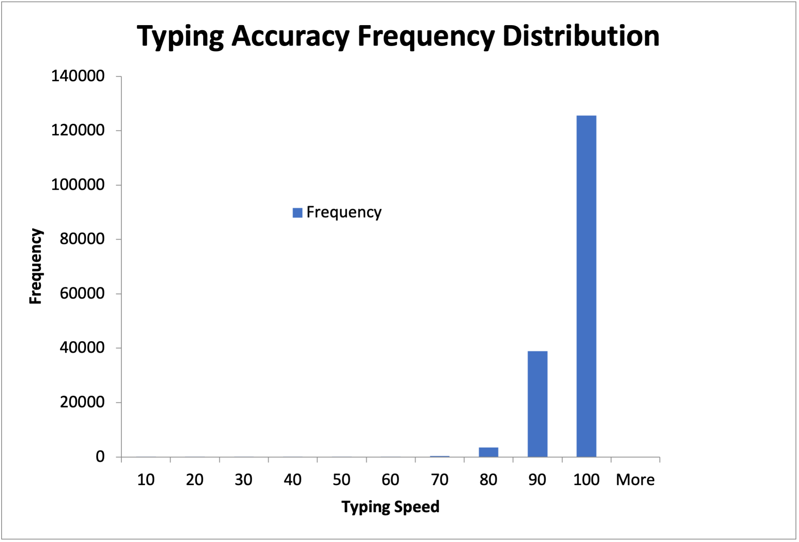
Figure 4: Frequency distribution plot of the average accuracy.

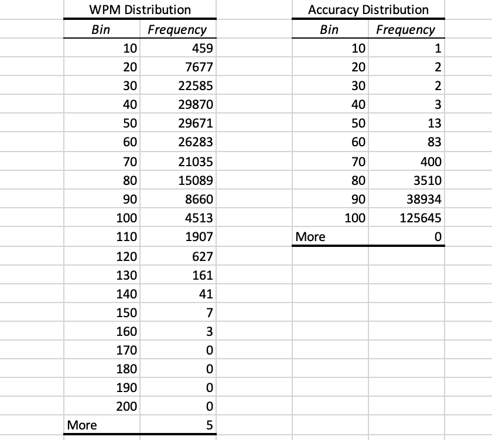
Figure 5: Frequency distribution table for both WPM and accuracy.

Figure 3 shows that participants' typing speed follows normal distribution. Figure 4 shows that most (129,534) of the particpants have perfect accuracy (100%) with no corrected or uncorrected error, and a little above 35,000 participants have 90% typing accuracy. The two figues (Figure 3 and 4) shows that typing accuracy and typing speed can be disjoint. That is, it is possible to type with high accuracy (little or no mistakes) and have slow typing speed.
Also, as recorded in Figure 5, there are 5 particpants with more than 200 WPM. This shows that there could be some inaccuracies with those participamnts' data as the maximum WPM ever recorded is 216. I looked up those participants and their participants IDs are `123625, 27932, 316206, 370956, 515892`. Upon further investigation on those participants, I found that a very high net WPM was found in one of the rows in the `wahab_keystrokes` table for each of the participants (see Figure 6 for example). I then looked up those participants raw data and found that the keyrelease timestamp for the sentence with super high WPM was wrong (see Figure 7). I then went ahead to fix that by using the keypress timestamp instead.

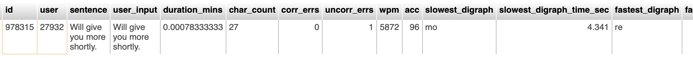
Figure 6: Super high WPM for particpant 27932.

<br>

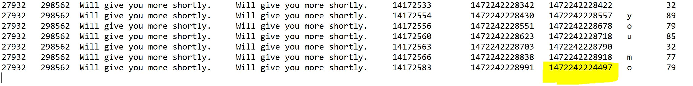
Figure 7: Image of the raw data showing that the last character of the sentence had a wrong/inconsistent keyrelease timestamp.

As shown in Figure 8 below, those 5 participants with inaccurate data have now been fixed. Emphasis on the highlighted part. Figure 9 shows the new (fixed) WPM and accuracy distribution tables.

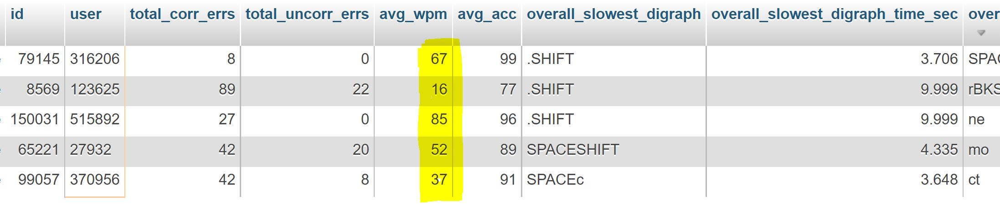
Figure 8: Screenshot from the database with all 5 participants WPM fixed and now accurate.


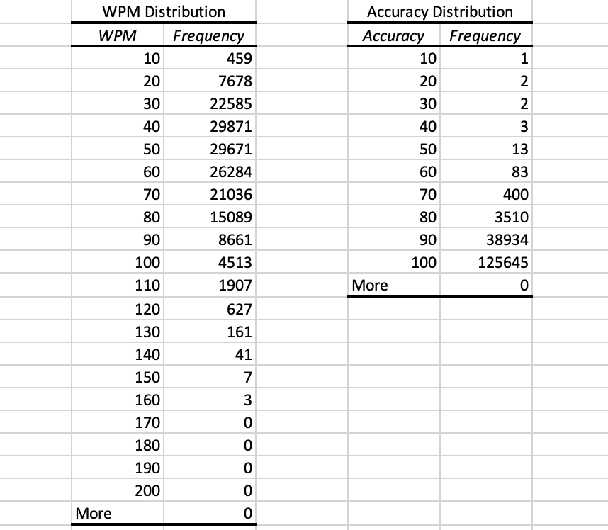
Figure 9: Updated WPM and Accuracy distribution.


# Goal Two
<h4>QUESTION: Can participants be grouped by their typing speed as either below average, average, fast or genious typer?</h4>

<h4>ANSWER</h4>
Using the result above, typing speeds are grouped as follows:

<strong>Below Average:</strong> All participants with less than 40 WPM are grouped as below average. <br>
<strong>Average:</strong> Participants with WPM from 40 to 59 are considered as average typist.<br>
<strong>Fluent:</strong> Participants with WPM ranging from 60 to 79 are grouped as fluent.<br>
<strong>Fast:</strong> Participants with WPM ranging from 80 to 99 are grouped as fast typist.<br>
<strong>Professional:</strong> Participants with WPM ranging from 100 to 119 are grouped as professional typist.<br>
<strong>Genious:</strong> Participants with 120 WPM and above are grouped as genious.

Figure 10 shows the frequency distribution of the typing speed grouping. As seen, most of the participants (about 68%) fall within the below average and average typing group and about 22% fall in the fluent group. Figure 11 is the distribution table. The figure and table were made with Excel from the CSV file that was outputted from the MYSQL database.

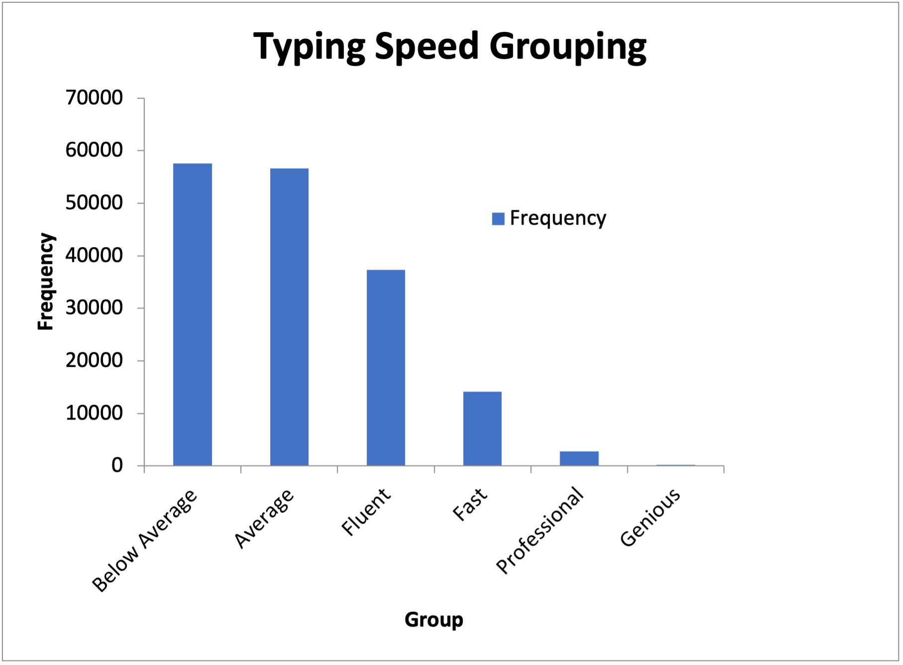
Figure 10: Typing speed grouping.

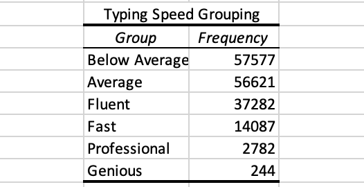
Figure 11: Typing speed grouping table.


# Goal Three
<h4>QUESTION: Are there characters or combination of characters (digraphs - two characters; trigraphs - three characters) that are faster or slower for each user? These characters or combination of characters can help differentiate users.</h4>

<h4>ANSWER</h4>
The purpose of this dataset was to study users typing pattern which can eventually be used for authentication. For this to be possible, there must be some distinctive characteristics in the sequential data of each user. One of the distinctive characteristics is to find the combination of keys (digraph - combination of two keys) that each user types fastest (within a short period) or slowest (takes longer to type).

To achieve this, I calculated the fastest and slowest digraphs with thier respective duration, for each sentence per user and also the overall fastest and slowest digraphs per user. These data are recorded in the MYSQL database `ia626` in the tables `wahab_keystrokes` and `wahab_summary` respectively. The code below was used.

```python
# Get fastest & slowest Down-Up digraphs
digraph_time = (int(float(split_line_next[6])) - int(float(split_line[5]))) / 1000 # In seconds
digraph = split_line[-2] + split_line_next[-2]
digraph = digraph.replace(' ','SPACE')
if digraph_time < fastest_digraph_time:
    fastest_digraph_time = digraph_time
    fastest_digraph = digraph
    if fastest_digraph_time < overall_f_digraph_time:
        overall_f_digraph_time = fastest_digraph_time
        overall_f_digraph = fastest_digraph
if digraph_time > slowest_digraph_time:
    slowest_digraph_time = digraph_time
    slowest_digraph = digraph
    if slowest_digraph_time > overall_s_digraph_time:
        overall_s_digraph_time = slowest_digraph_time
        overall_s_digraph = slowest_digraph
```

The Figure below (Figure 12) is a table that shows a snippet of the overall fastest and slowest digraphs for each user.

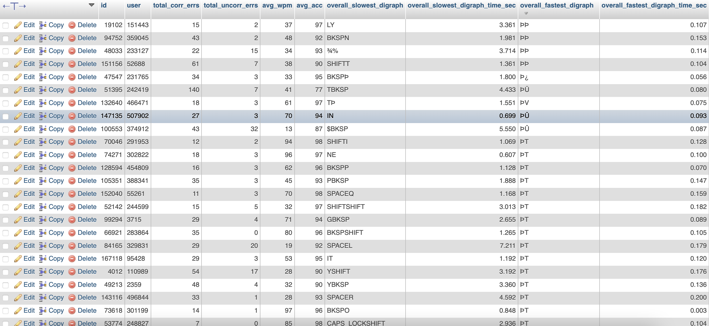
Figure 12: Screenshot from the database showing the overall slowest and fastest digraphs typed by each of the participants.